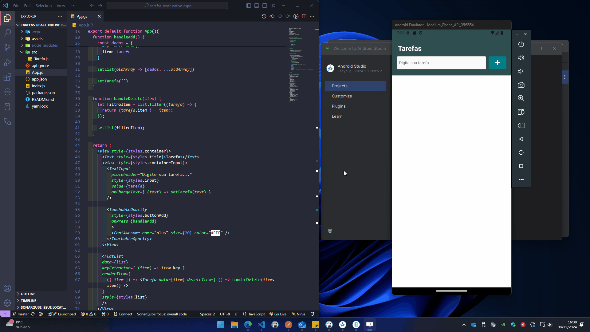

# O Projeto ⭐

Este projeto é uma aplicação bem simples de tarefas, onde o usuário pode adicionar novas tarefas e removê-las quando concluídas. Foi utilizado o **Expo** para simplificar o desenvolvimento do aplicativo em **React Native**. O Expo permite rodar o projeto tanto no desktop quanto no smartphone (quando conectados à mesma rede). Além disso, possibilita a emulação de um smartphone para acompanhar o desenvolvimento em tempo real.



---

## Ferramentas Utilizadas

- **Expo**: Framework para desenvolvimento em React Native.
  - Site oficial: [Aqui](https://expo.dev/)
- **Android Studio**: Utilizado para emular dispositivos Android no desktop.
  - Site oficial: [Aqui](https://developer.android.com/studio)

---

## Instalação do CLI do Expo

Para instalar o CLI do Expo de forma global, execute o comando:

```bash
npm install --global expo-cli
```

Para verificar se a instalação foi realizada corretamente, confira a versão do Expo com o comando:

```bash
expo --version
```

---

## Criando o Projeto

Para iniciar um novo projeto com o Expo, utilize o comando:

```bash
expo init nomeDoProjeto
```

No meu caso, escolhi o template blank, que cria um projeto padrão com o mínimo necessário para iniciar o desenvolvimento.

---

## Executando o Projeto

No diretório do projeto, execute o comando abaixo para iniciar o ambiente de desenvolvimento. Esse comando exibirá opções e gerará um QR Code para testar o app no smartphone:

```bash
npx expo start
```

---

## Testando no Smartphone

1. Baixe o aplicativo "Expo Go" na loja de aplicativos do seu smartphone.
2. Após rodar o comando `npx expo start`, abra a câmera do smartphone e escaneie o QR Code gerado.
3. O aplicativo será executado diretamente no smartphone, permitindo acompanhar o desenvolvimento em tempo real.

---

## Emulando no Desktop

Para emular o aplicativo no desktop, utilize o Android Studio:

* Baixe e instale o Android Studio: [Clique aqui](https://developer.android.com/studio)
* Configure o emulador de dispositivos Android no Android Studio e conecte-o ao ambiente Expo.